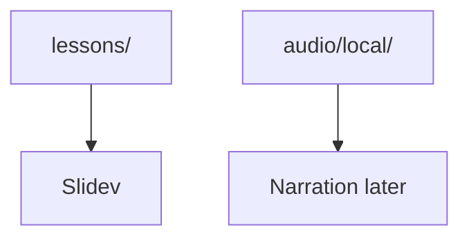

# Course workspace

Lessons live under `lessons/`. This deck is the Slidev entry point for local preview.

```mermaid
flowchart TB
  lessons[lessons/] --> slidev[Slidev]
  audio[audio/local/] --> narration[Narration later]
```
